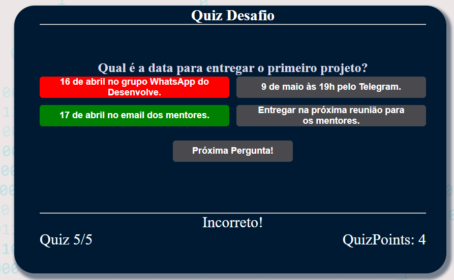
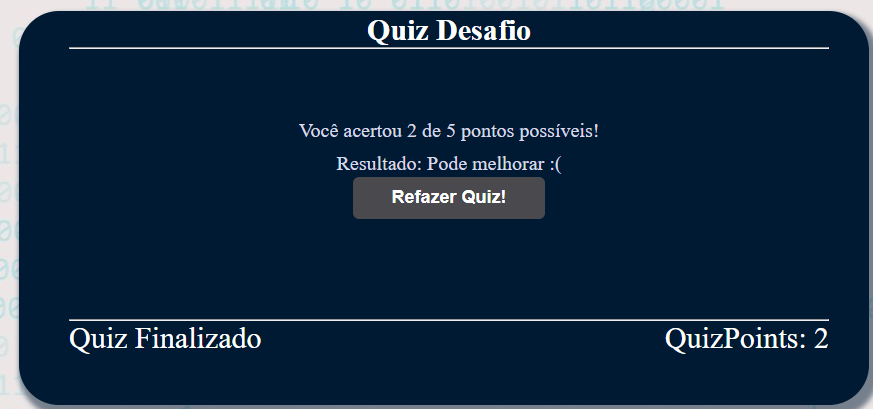

 
  
   Como Jogar o Quiz Desafio

  Para iniciar o quiz, clique no botão "Iniciar Quiz"! 

   

  Após clicar, você terá opções de múltipla escolha, com 4 ou 2 perguntas, sendo uma correta. 

  Ao selecionar a opção correta, o botão mudará para a cor verde. 

   

  Se selecionar a opção incorreta, o botão mudará para a cor vermelha e mostrará a opção correta em verde! 

   

  Depois de responder, clique na opção "Próxima Pergunta". 

    

  A partir da primeira pergunta, haverá um progresso de 1/6 do total de perguntas. Caso você acerte, ganhará 1 ponto; caso erre, não ganhará pontos.

   

  A partir da primeira pergunta, haverá um progresso de 1/5 do total de perguntas e um progresso de pontos fixo. O contador começará zerado e, após a primeira pergunta, será adicionado quando começar a segunda pergunta. Caso você acerte, ganhará 1 ponto; caso erre, não ganhará pontos.

   

  Após responder, você terá a opção de refazer o quiz! 

Vamos jogar? 

Arrumar deploy na GCP ou AWS) 

https://desafioquizdesenvolvebrsantos.s3.us-east-2.amazonaws.com/quiz/index.html

