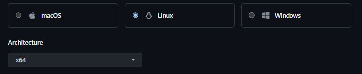
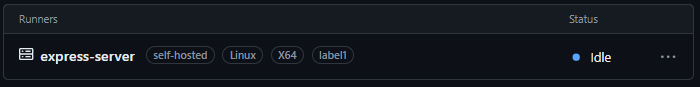
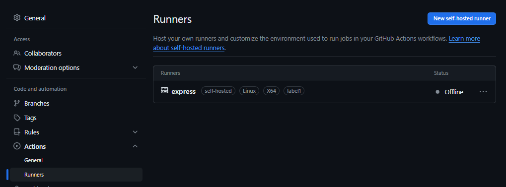
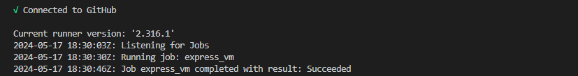
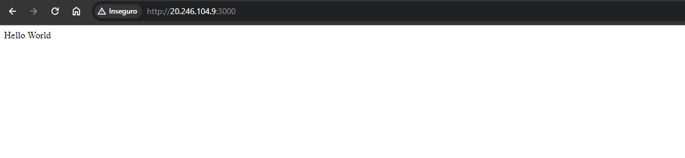

1. Instalar "GITHUB RUNNER" em uma VM Linux UBUNTU 20.04
Instalar dependências do GitHub Runner.
Criar a pasta actions-runner e definir que a execução ficará na pasta _work.
<p align="center">
  
</p>
- Caso tenha sucesso na instalação!
<p align="center">
  
</p>
Setup da Instalação:
Acesse via SSH o terminal da máquina e execute os seguintes comandos:

````
mkdir actions-runner
chmod 777 -R actions-runner
cd actions-runner
curl -o actions-runner-linux-x64-2.316.1.tar.gz -L https://github.com/actions/runner/releases/download/v2.316.1/actions-runner-linux-x64-2.316.1.tar.gz
echo "chave token" actions-runner-linux-x64-2.316.1.tar.gz" | shasum -a 256 -c
tar xzf ./actions-runner-linux-x64-2.316.1.tar.gz
./config.sh --url https://github.com/BrunoSantos88/Desenvolve-Trilha-SI --token "chavetoken"
./run.sh
````
<p align="center">
  
</p>
2. Setup do GitHub Action
Crie a pasta e o arquivo de execução github/workflows/express_app.yml. </p>
Passo 1: Definir a "branch" e "agente"

````
on:
  push:
    branches:  
      - desafio2

jobs:
  express_vm:
    runs-on: self-hosted
````

Passo 2: Checar repositório no GitHub
````
steps:
  - name: Checkout code
    uses: actions/checkout@v2
````
Passo 3: Executar script
````
- name: Install Container & NodeJs and NPM
  run: |
    chmod +x dependencia.sh
    if ./dependencia.sh; then
      echo "Install complete"
    else
      echo "Install failed"
    fi
````
Script Shell: dependencia.sh
````
#!/bin/bash
set -e 
sudo apt update -y
if [[ $? -ne 0 ]]; then
  echo "Update failed"
  exit 1
fi
sudo apt install docker.io -y
if [[ $? -ne 0 ]]; then
  echo "Docker installation failed"
  exit 1
fi
sudo apt install docker-compose -y
if [[ $? -ne 0 ]]; then
  echo "Docker Compose installation failed"
  exit 1
fi
sudo apt update -y
if [[ $? -ne 0 ]]; then
  echo "Second update failed"
  exit 1
fi
sudo apt install nodejs -y
if [[ $? -ne 0 ]]; then
  echo "Node.js installation failed"
  exit 1
fi
sudo apt install npm -y
if [[ $? -ne 0 ]]; then
  echo "NPM installation failed"
  exit 1
fi
echo "Install complete"
````
Passo4: Clonar repositório e alterar branch
````
- name: Clone repository
  run: |
    sudo git clone https://github.com/BrunoSantos88/Desenvolve-Trilha-SI.git
    cd Desenvolve-Trilha-SI
    sudo git checkout desafio2
````
Passo 5: Executar e levantar o docker-compose
````
- name: Deploy_UP_Express_APP
  run: |
    cd express_app
    sudo docker-compose up -d
    curl http://${{secrets.HOST_EXPRESS}}:3000
````
3. Enviar requisição curl após execução do comando
````
steps:
  - name: Send curl request
    run: |
      curl http://${{secrets.HOST_EXPRESS}}:3000

````
Após finnalizar Job Sucesso!
<p align="center">
  
</p>


<p align="center">
  
</p>