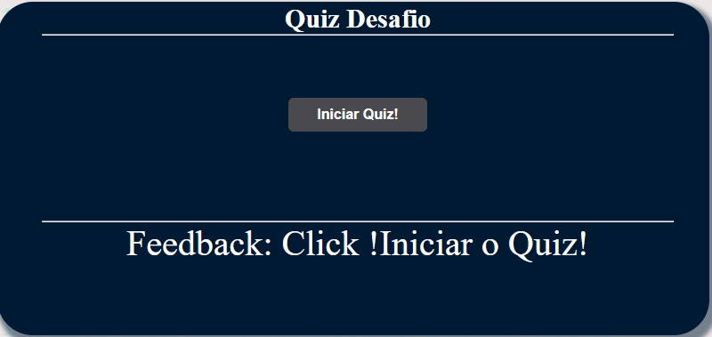
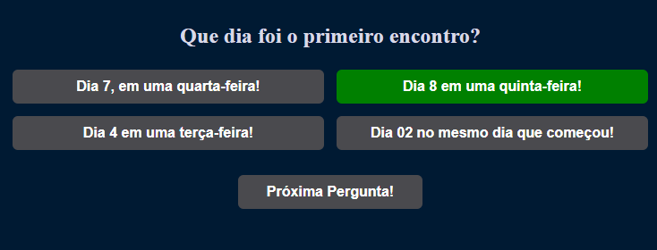
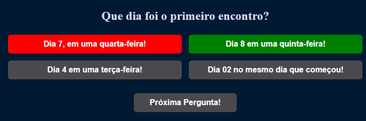
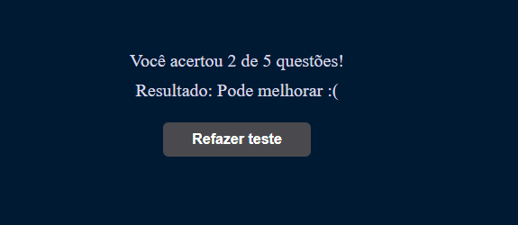

# Como jogar o quiz desafio 

Começando o quiz! Você vai começar clicando botao "Iniciar Quiz"! 

 

Após clicar, vai abrir opçao de multipla escolha, entre 4 ou 2 perguntas,sendo uma correta. 

Clicando na opão correta, botao de ira mudar para cor verde. 

 

Clicando na opão incorreta, botão de opçao incorreta, ele ira mudar para cor vermelha e vai monstra opoção correta na cor verde! 

 

Após responder, você ira clicar na opção Proxima pergunta!, Total de 5 perguntas 

 

Final quiz existe uma contagem de pontuação total de perguntas 

