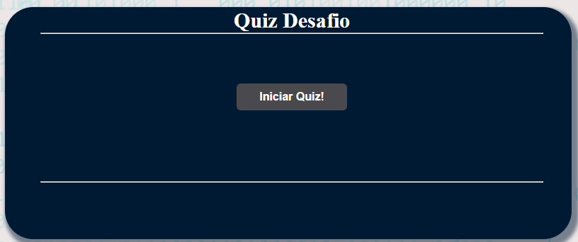
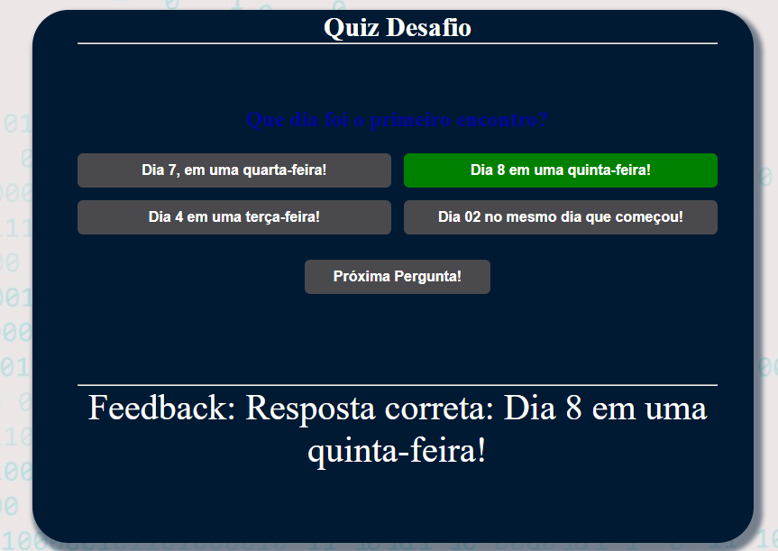

# Desafio desenvole 1  - Quiz
Projeto 1: Desafio de Perguntas e Respostas  </p>
Descrição do Projeto: </p>
- Quiz com 5 perguntas, usando HTML, CSS e JavaScript.
- Arquivos: index.html index.js e style.css
1. Interface Gráfica: </p>
○ Página HTML com a estrutura básica. </p>

2. Funcionalidades Básicas em JavaScript: </p>
○ Perguntas com opções de múltipla escolha. </p>
○ Feedback imediato sobre a resposta correta ou incorreta. </p>

○ Contagem de pontuação total. </p>

Critérios de Avaliação: </p>

1. Funcionalidade (70%): </p>
O quiz deve apresentar perguntas e opções de resposta. </p>
○ Feedback imediato sobre a correção da resposta. </p>
```
 'Qual foi o dia da aula inaugural do Desenvolve?',
      { text: 'Dia 02 de janeiro às 20h', correct: false, feedback: "Incorreto! Não houve nada neste dia. A primeira live foi no dia 29 de janeiro." },
      { text: 'Dia 29 de janeiro às 19h', correct: true, feedback: "Correto! Esse dia foi a primeira live do grupo Desenvolve." },
      { text: 'Dia 02 de Fevereiro às 20h', correct: false, feedback: "Incorreto! A primeira live foi no dia 29 de janeiro." },
      { text: 'Dia 08 de Fevereiro às 8h da manhã', correct: false, feedback: "Incorreto! A primeira live foi no dia 29 de janeiro." },
```
○ Contagem de pontuação total correta. </p>
