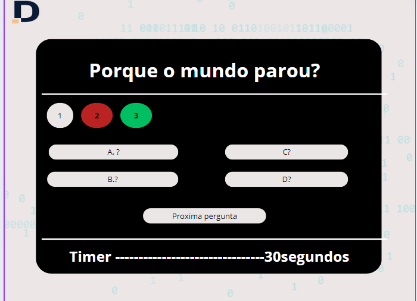

 # Desafio desenvole 1  - Quiz - Design piloto.

 - Etapa 1 (Tela inicial) 
 Quiz vai ter logo da empresa. 

 Quiz sera dentro caixa preta.  

 Quiz vai ter Titulo (Quiz desafio).  

 Quiz vai ter Botao (inicar quiz)centralizado 

 QUiz vai informar tempo maximo de cada pergunta. 

 

 - Etapa 2 (Tela perguntas) 
 Quiz vai ter logo da empresa. 

 Quiz sera dentro caixa preta.  

 Quiz ter as perguntas aond é o titulo.  

 Quiz vai 4 perguntas dentro caixa preta 

 Quiz vai ter um botao para (NextQuestion),caso jogar reponsa rapido.

 Quiz vai informar ao jogador qual pergunta ele está 

 Quiz vai informar, qual pergunta ele respodeu errada 

 Quiz vai informar, qual pergunta ele respodeu certa 

 Quiz vai informar o tempo abaixo das perguntas.

 

 - Etapa 3 (Tela encerranto) 
 Quiz vai ter logo da empresa. 

 Quiz sera dentro caixa preta.  

 Quiz vai informar que o quiz encerrou  

 Quiz vai informar quantas pergunetas acertou 

 Quiz vai ter um botao aonde vai informar, vc quer refazer o quiz

 

 
