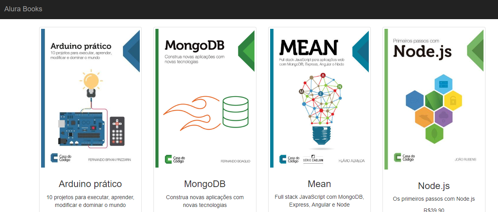

 # instalação docker 
 - documentação https://docs.docker.com/get-docker/

 - instalando linux

 ````
 sudo apt-get update

 sudo apt-get install \
    ca-certificates \
    curl \
    gnupg \
    lsb-release

curl -fsSL https://download.docker.com/linux/ubuntu/gpg | sudo gpg --dearmor -o /usr/share/keyrings/docker-archive-keyring.gpg
 ````
# Definindo a versão
 ````
echo \
  "deb [arch=$(dpkg --print-architecture) signed-by=/usr/share/keyrings/docker-archive-keyring.gpg] https://download.docker.com/linux/ubuntu \
  $(lsb_release -cs) stable" | sudo tee /etc/apt/sources.list.d/docker.list > /dev/null
````
````
sudo apt-get update -y
sudo apt-get install docker-ce docker-ce-cli containerd.io
````
# Commmandos docker
````
docker run hello-world
sudo docker run hello-world
````

# Criando um grupo

````
sudo usermod -aG docker $USER
````

# Executar container
````
docker run hello-world
docker ps
docker images
````


 # Analisando outros comandos importantes

 ``` 
 docker ps -a  = "verificar container que não estao up"
 docker stop "idcontainer" =  "parar container"
 docker start "idcontainer" =  "iniciar container"
 docker exec = "executar commando no container"
 docker exec -it "idcontainer" bash "executar commando no container, mode interativo"
   - "vc pode acessa esse container e modificar ou instalar"
docker ps = "visualizar container uptime"
docker rm "idcontainer" = "excluir container"
docker rm "idcontainer" --force "excluir container e forçar"
docker port "idecontainer" = saber qual porta container esta rodando"
docker run -d -p "imagens container" = "excutar container (-d) mode interativo (-p) flaq da porta, exemplo 80:80" = curl http://localhost:80.
 docker inspect "ipcontainer" = "inspecificação do container"
 docker history "idecontainer"  = "saber tempo da imagens ou uptime do container"
``` 

# Criando images dockerfile
``` 
docker pull = "baixar uma imagen"
 - exemplo = docker pull ubuntu:latest
docker run -it ubuntu:latest bash 
``` 

  ``` - Criando dockerfile - "Commando sempre com letras Maiusculas"
  FROM -- baixar imagen "ubuntu:lastest"
  RUN  -- commando "apt-get update"
  COPY -- copiar arquivo "index.html" 
  EXPOSE -- expor porta "80"
  CMD --- rodar um commando "["npm", "start"]"
  ENTRYPOINT -- rodar um arquivo  "npm start"
```

 # Criando a imagem

 ``` build
 docker build -t nomedaimagens:v1 .
 docker images " saber qual foi criada"
 docker run -d –p porta:porta "imagen que vc criou":v1
```

# Autenticando a conta do Docker Hub e Upload.

```docker login hub

- docker login -u "seucadastro"
 - vai solicitar senha *****

Authenticating with existing credentials...
Login Succeeded

- docker tag
- docker tag "sua imagens + imagendorepositorio:versao
- docker push
- docker push imagendorepositorio:versao
```

# Desafio Criando e gerencindo container 

- Baixar e extrair pasta node-app
- Baixar https://github.com/danielartine/alura-docker/blob/aula-3/app-exemplo.zip?raw=true

- Criar dockerfile
```dockerfile

FROM node:14
COPY app-node /usr/src/app
COPY package*.json ./
RUN npm install
COPY . .
EXPOSE 3000
CMD ["npm", "start"]
```

- Criando imagen
```
docker build -t meuappnode:v1 .
```

- Rodar aplicação
``` run imagen
docker run -d -p 3000:3000 meuappnode:v1
```


- Login dockerhub
``` login docker hub 
docker login 
- login
- senha
```

- Tag e Upload da imagens para dockerhub
```
docker tag  meuappnode:v1 repositoriodockehub:v1
docker push repositoriodockehub:v1
```

# Utilizando bind mounts

````
- mkdir volume-docker
- docker run -it -v /volume-docker:/app ubuntu bash
- cd app/
- touch arquivo-qualquer.txt
- docker run -it --mount type=bind,source=/C/Users/NoteCasa/Projetos/Desenvolve-Trilha-SI/- docker_semana_9/volume-docker,target=/app ubuntu bash
````

# Criando um volume
````
docker volume create meu-volume
docker run -it -v meu-volume:/app ubuntu bash
````

# Criando uma rede
````
docker network create alura "criar uma rede"
docker netework ls "visualizar as redes criadas"
docker network rm alura "remover rede alura"
docker network create --driver bridge minha-bridge  "criar uma rede e especificar o drive"
docker network create --driver=bridge --subnet=192.168.0.0/16 alura 
 - "criar uma rede,drive e subnet com cidr"
 - link documentação "https://docs.docker.com/reference/cli/docker/network/create/".
````
 #  Comunicando aplicação com banco

````
docker run -d --network minha-bridge --name meu-mongo mongo:4.4.6
docker run -d --network minha-bridge --name alurabooks -p 3000:3000 aluradocker/alura-books:1.0
````
- http://localhost:3000/seed
- http://localhost:3000/



# Docker Compose

- instalar linux ubuntu
````
sudo curl -L "https://github.com/docker/compose/releases/download/1.29.2/docker-compose-$(uname -s)-$(uname -m)" -o /usr/local/bin/docker-compose
sudo chmod +x /usr/local/bin/docker-compose
````

- docker-compose commandos
````
docker-compose ls
docker-compose up 
docker-compose up -d 
docker-compose down
````
- docker-compose.yml
````
version: "3.9"
services:
  mongodb:
    image: mongo:4.4.6
    container_name: meu-mongo
    networks:
      - alura
  
  alurabooks:
    image: aluradocker/alura-books:1.0
    container_name: alurabooks
    networks:
      - alura
    ports:
      - 3000:3000

networks:
  alura:
    driver: bridge
````