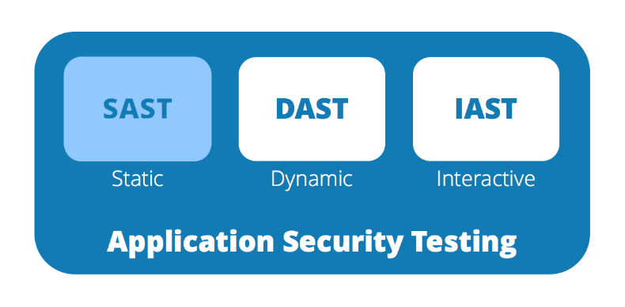
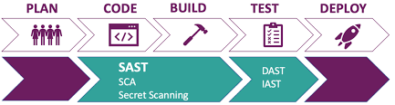

  <h3> Injections a Broken Access Control - Semana 12 </h3>  </p>

# A1 Injections SQL

- Exemplos de cenários de ataque
Cenário nº 1: um aplicativo usa dados não confiáveis ​​na construção da seguinte chamada SQL vulnerável:
 ````
String query = "SELECT \* FROM accounts WHERE custID='" + request.getParameter("id") + "'";
 ````
- Cenário #2: Da mesma forma, a confiança cega de uma aplicação em frameworks pode resultar em consultas que ainda são vulneráveis, (por exemplo, Hibernate Query Language (HQL)):
 ````
 Query HQLQuery = session.createQuery("FROM accounts WHERE custID='" + request.getParameter("id") + "'");
  ````
- Em ambos os casos, o invasor modifica o valor do parâmetro 'id' em seu navegador para enviar: ' UNION SLEEP(10);--. Por exemplo:
````
http://example.com/app/accountView?id=' UNION SELECT SLEEP(10);--
 ````

- Isso altera o significado de ambas as consultas para retornar todos os registros da tabela de contas. Ataques mais perigosos podem modificar ou excluir dados ou até mesmo invocar procedimentos armazenados.

hql link: Link: https://www.geeksforgeeks.org/hibernate-query-language/

# A2 Broken Authentication

- Credential stuffing

- O credential stuffing é um tipo de ataque cibernético que se aproveita do mau hábito dos usuários de reutilizar senhas; por isso, é preciso ser consciente no momento de escolher a sua combinação de segurança.

link: https://owasp.org/www-project-top-ten/2017/A2_2017-Broken_Authentication

# A3 Sensitive Data Exposure
Link: https://github.com/OWASP/www-project-top-ten/blob/master/2017/A3_2017-Sensitive_Data_Exposure.md

# A4:2017-XML External Entities (XXE)

codigo exemplo.

````
<?xml version="1.0" encoding="ISO-8859-1"?>
<!DOCTYPE foo [
<!ELEMENT foo ANY >
<!ENTITY xxe SYSTEM "file:///etc/passwd" >]>
<foo>&xxe;</foo>

<!ENTITY xxe SYSTEM "https://192.168.1.1/private" >]>

<!ENTITY xxe SYSTEM "file:///dev/random" >]
````

- O treinamento do desenvolvedor é essencial para identificar e mitigar o XXE. Além disso, prevenir XXE requer:
- Sempre que possível, utilizar formatos de dados menos complexos, como JSON, e evitar a serialização de dados confidenciais.
- Corrija ou atualize todos os processadores XML e bibliotecas em uso pelo aplicativo ou no sistema operacional subjacente. Use verificadores de dependência. Atualize o SOAP para SOAP 1.2 ou superior.
- Desative a entidade externa XML e o processamento DTD em todos os analisadores XML no aplicativo, conforme a Folha de Dicas da OWASP 'XXE Prevention' .
- Implemente validação, filtragem ou higienização positiva de entrada no lado do servidor (“lista de permissões”) para evitar dados hostis em documentos XML, cabeçalhos ou nós.
- Verifique se a funcionalidade de upload de arquivos XML ou XSL valida o XML recebido usando validação XSD ou similar.
- As ferramentas SAST podem ajudar a detectar XXE no código-fonte, embora a revisão manual do código seja a melhor alternativa em aplicativos grandes e complexos com muitas integrações.
Se esses controles não forem possíveis, considere usar patches virtuais, gateways de segurança de API ou Web Application Firewalls (WAFs) para detectar, monitorar e bloquear ataques XXE.

<div style="display: flex;">
    
    
    
</div>

Link: https://owasp.org/www-project-top-ten/2017/A4_2017-XML_External_Entities_(XXE)