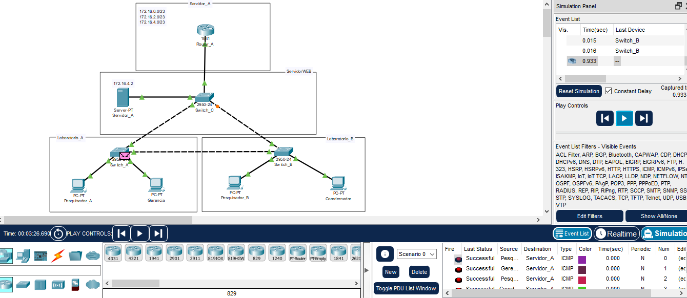
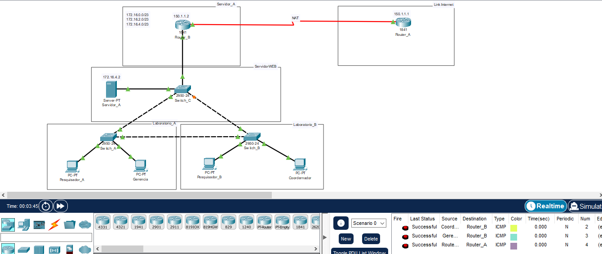

# Desenvolve-Security
- Aulas Trilha CyberSecuirty - Alura
- Projeto que construímos no curso anterior, a rede apresenta conexão com a internet, suporte para mais de 600 dispositivos conectados, segmentação entre os diferentes setores que constituem o Instituto.
- Além disso, temos um servidor com acesso mais restrito (Políticas de acesso), pois armazena dados sensíveis da instituição e das pessoas colaboradoras. Também precisamos suportar um serviço de VolP.
- Tudo isso já está configurado, mas surge um questionamento: como o computador do pesquisador A consegue acessar algo que está no provedor de serviços, que está na internet?
 # Semana 5-6-7-8
- Redes: dos conceitos iniciais à criação de uma intranet
- Redes: construindo um projeto com VLANs, políticas de acesso e conexão com internet
- Redes: implementando roteamento, DNS e IPv6
- Redes Wi-Fi: criando uma rede sem fio de modo seguro
# Redes: dos conceitos iniciais à criação de uma intranet
- Camada física
- Camada de rede
- Camada de transporte
- Camada de aplicação
 # Commandos redes
 - Ping e Traceroute
 - Ping e Traceroute - ip
 - tracert -d  www.alura.com.br; rota ate site 
 - ping www.alura.com.br; echo ate o site
 - nslookup www.alura.com.br
 # instalar packet tracert
 - Arquitetura packet tracert
 - usar Hub0 3 pc
 - IP 192.168.3.1 192.168.3.2 192.168.3.3
 - Manufatura - Acabamentos - Embalagem
 # Monitorar Redes
  - install wireshark wireshark.org.
 # Class IP 
 - Classe A: 10.0.0.0
 - Classe B: 172.16.0.0 a 172.31.0.0
 - Classe C: 192.68.0.0

# Redes: construindo um projeto com VLANs, políticas de acesso e conexão com internet 
 - Configuração Vlan
 - Configuração Router
 - Configuração de acesso servidores
 - Configuração STP Switch
 - Congiguração controle ACL
 - Nat
# Redes: implementando roteamento, DNS e IPv6 - modulo 7
- OSPF
- BGP
- DNS
- RIP
- IPV6
 # Redes Wi-Fi: criando uma rede sem fio de modo seguro - moduo 8
 - Crie uma rede sem fios com o protocolo WiFi
 - Conheça sobre as diferentes versões do WiFi
 - Configure um sistema EAP para controle de acesso
 - Implemente senhas nas redes sem fio
 - Explore os principais protocolos auxiliares de WiFi

 # Laboratorio_STP e Semana_6

 - Switch_A e Switch_B

 ````
enable
configure terminal
vlan 10
name pesquisa
exit
vlan 20
name administrativo
exit
vlan 30
name servidores
exit
interface Fa 0/1
switchport mode access
switchport access vlan 10
exit
interface fa 0/2
switchport mode access
switchport access vlan 20
exit
interface Fa 0/3
switchport mode trunk
 ````

Switch_C
 ````
enable
configure terminal
vlan 10
name pesquisa
exit
vlan 20
name administrativo
exit
vlan 30
name servidores
exit
interface Fa 0/4
switchport mode access
switchport access vlan 30
exit
 ````

 Router_B

 ````
enable
configure terminal
interface Fa 0/0
no shutdown
configure terminal
ip dhcp pool vlan10
network 192.168.10.0 255.255.255.0
exit
ip dhcp pool vlan20
network 192.168.20.0 255.255.255.0
exit
interface Fa 0/0.1
encapsulation dot1Q 10
ip address 192.168.10.1 255.255.255.0
exit
interface Fa 0/0.2
encapsulation dot1Q 20
ip address 192.168.20.1 255.255.255.0
exit
ip dhcp pool vlan10
default-router 192.168.10.1
exit
ip dhcp pool vlan20
default-router 192.168.20.1
exit
````

- Alterar Router_B

````
enable
configure terminal
interface Fa 0/0.1
no shutdown
configure terminal
ip dhcp pool vlan10
network 172.16.0.0 255.255.254.0
default-router 172.16.0.1
exit
ip dhcp pool vlan20
network 172.16.2.0 255.255.254.0
default-router 172.16.2.1
exit
interface Fa 0/0.1
ip address 172.16.0.1 255.255.254.0 
exit
interface Fa 0/0.2
ip address 172.16.2.1 255.255.254.0
exit
interface Fa 0/0.3
encapsulation dot1Q 30
ip address 172.16.4.1 255.255.254.0
exit
````

- Controle ACL para o servidor 172.16.4.2
````
enable
configure terminal
ip dhcp excluded-address 172.16.2.2
ip dhcp excluded-address 172.16.2.4
ip access-list extended gerencial
permit tcp 172.16.2.2 0.0.0.0 172.16.4.2 0.0.0.0
permit tcp 172.16.2.4 0.0.0.0 172.16.4.2 0.0.0.0
deny tcp 172.16.2.6 0.0.255.255 172.16.4.2 0.0.0.0
deny tcp 172.16.0.2 0.0.255.255 172.16.4.2 0.0.0.0
deny tcp 172.16.0.4 0.0.255.255 172.16.4.2 0.0.0.0
permit ip any any
exit
````

- Configurar Router_B para DNS 
````
enable
configure terminal
ip dhcp pool vlan10
dns-server 172.16.4.2
exit
ip dhcp pool vlan20
dns-server 172.16.4.2
````



- Configura Router-A NAT.

- Router_A Provedor
```
enable
configure terminal
interface serial 0/1/0
ip address 150.1.1.1 255.255.255.252
exit
no shutdown
```

- Router_B _Servidor Local
```
enable
configure terminal
interface serial 0/1/0
ip address 150.1.1.2 255.255.255.252
exit
no shutdown
ip access-list standart NAT
permit 172.16.0.0
permit 172.16.0.0 0.0.255.255
interface Fa 0/0.1
ip nat inside
interface Fa 0/0.2
ip nat inside
interface serial 0/1/0
ip nat outside
ip nat inside source list NAT overload
exit
```
- Commando Router_B
- show ip nat translations
- ping 150.1.1.1

